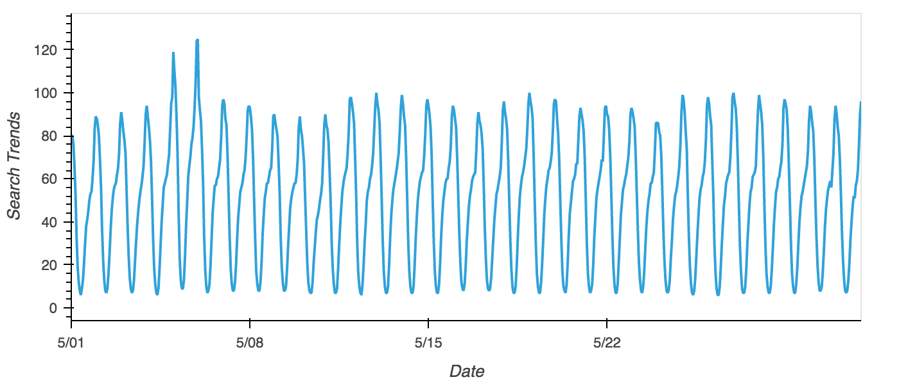

## Dev

The code has been written in Python using Google colab. To execute the code, the file "forecasting_net_prophet.ipynb" needs to be uploaded to colab.research.google.com.

Open "colab.research.google.com" and login using your gmail id, then upload the ipynb file and then the code can be viewed and executed. 

## Pre-requisites

should be able to access and use Google colab and the below files must be available to ensure the code will be able to upload the following files on to Google drive to execute the code. 

google_hourly_search_trends.csv
mercado_daily_revenue.csv
mercado_stock_price.csv

## What does the code do ?

The code performs data analysis to analyze the financial and user data of MercadoLibre which is one of the popular e-commerce sites. 
The code further performs the following in attempt to provide a statistical analysis search traffic trends, sales and revenue performance using Python and Google's colab.

Following data analysis has been done..

Step 1: Find unusual patterns in hourly Google search traffic

This step analyzes the Google search traffic trends with the help of data provided in "google_hourly_search_trends.csv" file and further identifies if there are any unsual traffic trends observed including peak and weak periods of search trends.

Following are the steps performed to analyze the Google search traffic trends

1.1 Analyze and plot the search traffic for the May2020 which is the month when MercadoLibre released its financial results

    

    And, finally calculate the total value of search traffic for the May2020 which was found to be : 38181 

1.2 Calcuate the median of the search traffic trends for all the months and get the cumulative value of search traffic for all the months

    the search traffic value for all the months was 2996 which is lesser than that of May month.

    Conclusion was that the search traffic did increase during the month of may

Step 2: Mine the search traffic data for seasonality

In this section, the seasonality of Search Trends are calcuated and following was done..

2.1 Calculate and plot the hourly search traffic trend to identify the average search traffic for a day of the week.

    !TrafficSearchTrends_DayofWeek.png

2.2 Used hvplot.heatmap to visualize the hourly search traffic for day of the week.

    !SearchTrends_DayofWeek_heatmap.png

2.3 Group the data by week of the year to identify if the search traffic has increased during the winter months from month 40 to 52

    !TrafficSearchTrends_DayofWeek.png

Conclusion : Yes - the search traffic did increase during the winter months

Step 3: Relate the search traffic to stock price patterns

Following analysis was done to analyze stock price patterns

3.1 Plot the Stock price data to see the trends

    !Plot_StockPriceData.png

3.2 Concatenate the Stock price data and the search trends data into one dataframe to compareand plot the search trends and closing prices of the first half of 2020

    Following was the conclustion..

    The understanding is that the Search Trends stayed within the tight range through out the period with a short uptick on 5/5/2020 whereas the 
    Closing price was fluctuating - was trending down from the later part of 2nd month until the 4th month of 2020 and 
    has shown a strong uptrend from 4/2020 through out the period. 

3.3 Calculate Stock Volatility (to identify the volatility of stocks), Lagged Search Trends (to identify the unsual patterns in search trends), 
    Hourly Stock Returns and perform correlation on the 3

    !Correlation

    Following can be concluded from the derived correlation data..

    The above correlation table suggests that there is a weak negative correlation between Stock Volatility and Lagged Search Trends and a 
    weak negative correlation between Lagged Search Trends and Stock Price Returns. Also there is a weak positive correlation between Stock Volatility and Hourly Stock Returns 

Step 4: Create a time series model with Prophet

4.1  This section perform even deeper and finer data analysis using Prophet model
        
        !PopularityTrend-1
        !PopularityTrend-1

        Produced popularity forecasts suggests that the popularity of MercadoLibre is decreasing going into 2020

4.2 Plot the different time series components to analyze upper, lower, best and worst case scenarios of search trends

    !yhat-lower_yhat-upper.png
    !PlotComponents-1
    !PlotComponents-2

    Conclusion..

    Question: What time of day exhibits the greatest popularity?

    Answer: Most popularity is seen at 00:00:00

    Question: Which day of week gets the most search traffic?

    Answer: Tuesday

    Question: What's the lowest point for search traffic in the calendar year?

    Answer: October month

Step 5 (optional): Forecast revenue by using time series mode
 
Though option, this activity was also performed successfully and based on the results following conclustion was drawn.

Based on the results above - the total expected sales next quarter would be most likely 6920 million dollars which will be approximately 6.9 Billion Dollars with the best case scenario being 8 billion and the worst case scenario being 5.7 billion dollars.
    
## Execution process

Logon to colab.researh.google.com
Upload the Jupyter notebook forecasting_net_prophet.ipynb
Start executing the code by running each cell in sequence

To view the code on the system..

Clone the directory which contains all the .csv files and the .ipynb file to your system using the following commands

git clone https://github.com/venbn/Module11-HW.git

Once the clone completes.. 

Go to the directory "Module11-HW"

cd Module11-HW

Execute 'Jupyter notebook' command

In the Jupyter notebook interface, open the file 'financial-planner.ipynb'

You should be able to see the code
